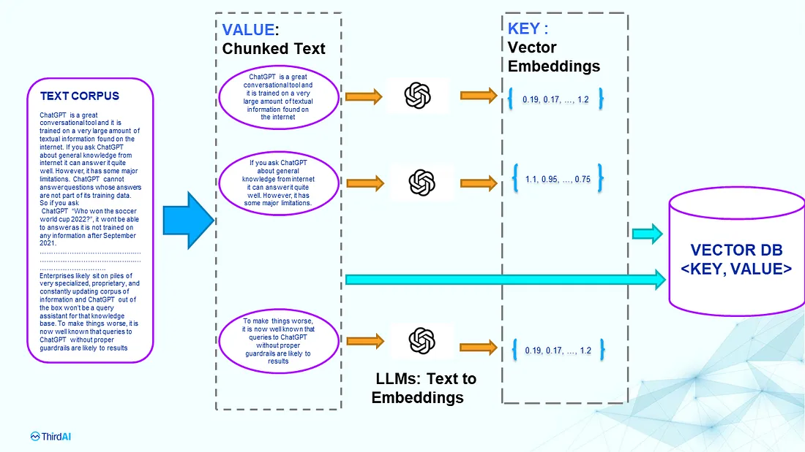
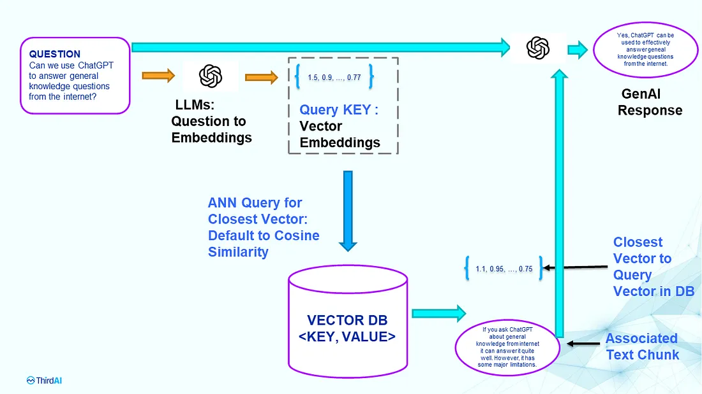

# LLM Techniques

## Vector-Based Search

### Algorithm for Implementation
1. Keeping a database of text inputs (e.g.: memorizing a set of good examples for specific prompts)
2. Getting a multidimensional vector representation for a text input

3. Searching and computing similarity (e.g.: cosine similarity = angle between vectors) between your text input and your database

4. Take the results based on the highest similarity scores and use them

**NOTE:** The query latency is the sum of three latencies: Embedding the question text latency + Vector DB retrieval Latency + GenAI’s text response generation latency

### Vector Database
Uses embeddings to match similar words/meanings together.
Basically it stores array of numbers clustered together based on similarity and indexes them for search.
Uses an **approximate near-neighbor search** ([ANN](https://towardsdatascience.com/comprehensive-guide-to-approximate-nearest-neighbors-algorithms-8b94f057d6b6)) to search by vector key.

#### Formal definitions 

- Vector Database: A vector database indexes, stores, and provides access to structured or unstructured data (e.g., text or images) alongside its vector embeddings, which are the data's numerical representation. It allows users to find and retrieve similar objects quickly at scale in production.
- Vector Embeddings: Vector embeddings numerically capture the semantic meaning of the objects in relation to other objects. Thus, similar objects are grouped together in the vector space, which means the closer two objects, the more similar they are.
- Vector Search: Vector embeddings allow us to find and retrieve similar objects from the vector database by searching for objects that are close to each other in the vector space, which is called vector search, similarity search, or semantic search.
- Vector Indexing: the underlying idea is to pre-calculate the distances between the vector embeddings and organize and store similar vectors close to each other (e.g., in clusters or a graph), so that you can later find similar objects faster

#### Use Cases
- Enhance LLM Applications:
  - Long-term memory for LLM (e.g.: keeping historic user conversation)
  - Improve context information for LLM
- Searching: Can be used for image to image search, text to image search, image to search text
- Recommendations based on input
- Classification based on input

#### Implementations
- [OpenAI Embeddings](https://platform.openai.com/docs/guides/embeddings/what-are-embeddings): helps retrieve vector information from text and comparison algorthims
- [OpenAI Cookbook: List of Vector Databases](https://cookbook.openai.com/examples/vector_databases/readme)
- [Azure AI Search](https://learn.microsoft.com/en-us/azure/search/search-what-is-azure-search)
- [Weaviate](https://github.com/weaviate/weaviate)
- [Chroma](https://github.com/chroma-core/chroma)
- [RediSearch](https://github.com/RediSearch/RediSearch)
- [PgVector](https://github.com/pgvector/pgvector)

#### Limitations
- Changes to the LLM used for embedding require re-indexing of the whole Vector DB.
- Privacy risk (both towards the LLM embedding model and for the Owner of the Vector DB)
- Cost Awareness (cost by token for embedding, cost of dimensionality of vector)
- Query Latency
- ANN may be slow or inaccurate and retrieval failures might be hard to fix
- Updates and deletions are problematic (slow)

#### Alternatives
- [Neural Database](https://medium.com/thirdai-blog/neural-database-next-generation-context-retrieval-system-for-building-specialized-ai-agents-with-861ffa0516e7)
  - Why: The key concept is to bypass the embedding process entirely and approach the retrieval problem as a neural prediction system that can be learned end-to-end
  - Implementations:
    - [ThirdAI Neural DB](https://www.thirdai.com/neuraldb/)
  - Papers:
    - [NeurIPS-2019](https://proceedings.neurips.cc/paper_files/paper/2019/file/69cd21a0e0b7d5f05dc88a0be36950c7-Paper.pdf)
    - [KDD-2022](https://dl.acm.org/doi/10.1145/3534678.3539414)

### Useful Links

- [What is a vector database](https://weaviate.io/blog/what-is-a-vector-database)
- [From prototype to production: Vector databases in generative AI applications](https://stackoverflow.blog/2023/10/09/from-prototype-to-production-vector-databases-in-generative-ai-applications/)
- [An intuitive introduction to text embeddings](https://stackoverflow.blog/2023/11/09/an-intuitive-introduction-to-text-embeddings/)
- [How vector search and semantic ranking improve your GPT prompts](https://youtu.be/Xwx1DJ0OqCk)
- [Vector search and state of the art retrieval for Generative AI apps](https://youtu.be/lSzc1MJktAo)
- [Vector Database Fireship](https://youtu.be/klTvEwg3oJ4)
- [Azure Implementation of Vector/Keyword Search Example](https://gist.github.com/pablocastro/90677135ddbd1f8a4783006f6e890edf)
- [OpenAI Embeddings and Vector Databases Crash Course](https://youtu.be/ySus5ZS0b94)
- [Understanding the Fundamental Limitations of Vector-Based Retrieval for Building LLM-Powered Chatbots](https://medium.com/thirdai-blog/understanding-the-fundamental-limitations-of-vector-based-retrieval-for-building-llm-powered-48bb7b5a57b3)
- [Semantic Search in the Context of LLMs](https://medium.com/@zahmed333/semantic-search-in-the-context-of-llms-7961308cd6ad)
- [Comprehensive Guide To Approximate Nearest Neighbors Algorithms](https://towardsdatascience.com/comprehensive-guide-to-approximate-nearest-neighbors-algorithms-8b94f057d6b6)

## LangChain

A framework used to combine multiple LLM together with external sources of computation and data.

https://learn.deeplearning.ai/langchain/lesson/2/models,-prompts-and-parsers
https://youtu.be/lG7Uxts9SXs
https://youtu.be/aywZrzNaKjs

## RAG
https://cookbook.openai.com/examples/fine-tuned_qa/ft_retrieval_augmented_generation_qdrant
https://arxiv.org/abs/2005.11401