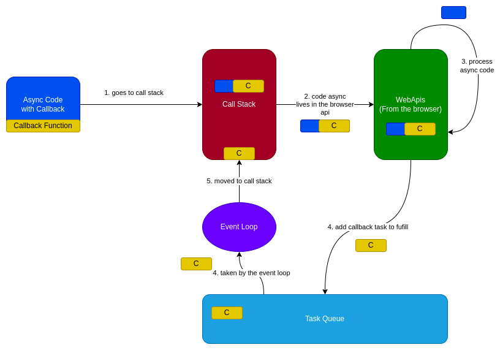
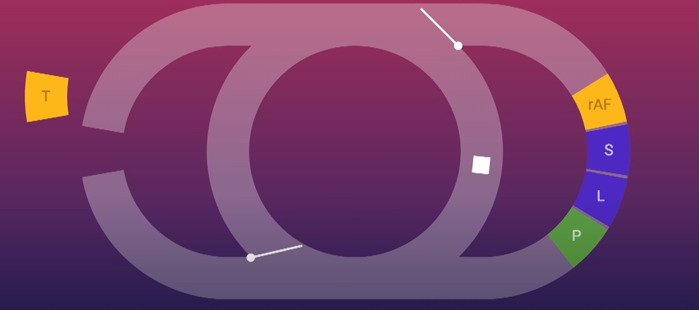

# Javascript STC

Javascript is an interpreted language created by Brendan Eich in 1995.

## 1. Async Code Process



- The Javascript Environment is a single-threaded environment with a call-stack from which it pops the next line to be processed.
- Whenever there is an `async code` *(xhr requests, setTimeouts, etc)* then it uses the browser web api for multi-threading.
- Once the async code is processed the `callback task` will be added to the task queue
- The event loop will go through its flows take the callback and add it back to the main Call Stack

## 2. The Event Loop




- It allows to perform non-blocking I/O in spite of the fact that JS is single-threaded
- It offloads operation processes to the Browser (or in case of Node.js to the system kernel).
- Once a `task` becomes available the loop will take it (and maybe alongside several others)
- After this, it will go to process `animation frames`, calculate `styles`, create `layout` data and `paint` data on the screen.

## 3. Task and Micro-Task

- Micro-Task Definition
```
A microtask is a short function which is executed after the
function or program which created it exits and only if the JavaScript 
execution stack is empty, but before returning control to the event 
loop being used by the user agent to drive the script's execution environment.
```
- Task
```
A task is any JavaScript code which is scheduled to be run by the 
standard mechanisms such as initially starting to run a program, 
an event callback being run, or an interval or timeout being fired.
```

- How it works

```
First, each time a task exits, the event loop checks to see if the task is 
returning control to other JavaScript code. If not, it runs all of the 
microtasks in the microtask queue. The microtask queue is, then, processed 
multiple times per iteration of the event loop, including after handling events 
and other callbacks.

Second, if a microtask adds more microtasks to the queue by calling queueMicrotask(), 
those newly-added microtasks execute before the next task is run. 
That's because the event loop will keep calling microtasks until there are none 
left in the queue, even if more keep getting added.
```

- Note: Promises callbacks are set using Micro-task

## 4. Execution Context

A context is, in essence, a level of scope within your code. As one of these code 
segments begins execution, a new context is constructed in which to run it; 
That context is then destroyed when the code exits. There are three types:

- The global context is the execution context created to run the main body of your code; that is, any code that exists outside a JavaScript function.
- Each function is run within its own execution context. This is frequently referred to as a "local context."
- Using the ill-advised `eval()` function also creates a new execution context.

## 5. Web Workers

Are meant for running intensive I/O operations without blocking the main thread. Once created it can communicate with the 
JS code that created it by posting/receiving messages through event handlers (`postMessage`, `addEventListener`).

**Notes**
- It cannot modify directly the DOM, that can only be done on the Main Thread.
- A page can spawn multiple web workers
- It cannot intercept network requests
- Lifecycle tightly coupled with the tab it belongs to.

**Libraries**
- [Comlink](https://github.com/GoogleChromeLabs/comlink)

## 6. Service Workers

Specialized JS assets (basically a JS script) that act as proxies between the web browser and the web servers.

**Lifecycle**
1. Register
2. Install (Triggers `install` event) - Example: here you cache data
3. Activate (Triggers `activate` event) - Example: here you remove old cache data

**Other events**
- Fetch event `fetch` - Example: used for intercepting requests and if no connection retrieve data from cache
  - Note you can cache here the files after one response

**Use Cases**
- Caching assets & API calls
- Push Notifications
- Background data sync/preload
- PWA

**Notes**
- Terminated when not being used
- It cannot modify directly the DOM
- Require https unless on localhost
- A single service worker controls all active tabs under the scope it was registered
- Allows you to intercept network requests (via `fetch` event)

**Libraries**
- [Workbox](https://developer.chrome.com/docs/workbox/)

## 7. Push Notifications

Basically a message sent from a web server to a browser application with the advantage that 
the client will receive the message even if it's browser tab is closed.

**Notes**
- Your app will not poll for messages
- The subscription object contains an *endpoint url*, to which the server will send encrypted messages.
- Each subscription is unique for a service worker
- [See more](https://www.youtube.com/watch?v=N9zpRvFRmj8)

**Workflow**
1. The user subscribes to the push service
2. The push service returns a `subscription object`
3. Your app saves subscription object to the server
4. Send a push message from your server to the user via the push service
5. The service worker handles the push message

## 8. "This" in JavaScript

`This` refers to an object and it depends on context being used:
- Alone it refers to the global objects
- In a function it refers to the global object
- In a function in strict mode it is undefined
- In an event it refers to the element that received the event
- In a simple method (function belonging to an object) it refers to the object
- In an arrow function there is no binding of `this` it always represent the object that defined the arrow function.

There are 3 methods which modify how `this` is handled:
- `call` to use a method belonging to another object, you will pass the `this` object (and also params if needed)
  - Example: ```person.fullName.call(person1, 'Oslo', 'Norway');```
- `apply` similar to `call` only that it takes arguments as an array
  - Example: ```person.fullName.apply(person1, ['Oslo', 'Norway']);```
- `bind` let's an object *borrow* a method from another object, thus binding the `this` to 
  - Example: ```person.fullName.bind(member);```
  
## 9. Prototype Chaining

Similar to inheritance, is used to build new types of object based on existing ones.
You have a `__proto__` object inside every object which defines any attribute 'inherited'.

## 10. Scope in JS

Scope is the accessibility of variables, functions, and objects in some particular part of your code during runtime.
**Types:**
- Global Scope: any variable not in a function/block is inside the global scope and accessible from everywhere.
- Local Scope (Function Scope): any variable declared inside a function is inside here and only accessible from here.
- Block Scope (ES6): variables declared in a pair of curly braces
```javascript
{
    let greeting = 'Hello world';
    console.log(greeting);
}
```
Your scope can be nested in other scopes (e.g.: a function which also has block of curly braces and inside it a variable)

## 11. Scope Chain

JS looks for a variable inside its current scope, if not found it searches outwards for it until it reaches the global scope.

## 12. Closure

Closures is an ability of a function to remember the variables and functions that are declared in its outer scope.

## 13. Modules

Small units of independent code. Most of the cases are just .js files which contain functions, constants, etc.. 

## 14. Arrow Functions

A shorter syntax for a function with the added difference 
that it does not have its own `this`, `super`, `new.target`. 

## 15. Rest Parameter and Spread Operator

The **rest parameter** is an improved way to handle a function with undetermined number of parameters.
It should be the last parameters in the method.
```javascript
function f(a, b, ...theArgs) {
  // ...
}
```
The **spread operator** allows iterables (arrays/objects/strings) to be expanded into single elements.
```javascript
function calculateSum(x, y, z) {
  return x + y + z;
}

const numbers = [1, 2, 3];

console.log(calculateSum(...numbers)); // 6
```

## 16. Generator Functions

Allows for the definition of an iterative algorithm to return data.
When called the generator functions do not initially execute their code, but return an Iterator
which can be consumed by calling the `next` method.
Example:
```javascript
function* fibonacci() {
  let current = 0;
  let next = 1;
  while (true) {
    let reset = yield current;
    [current, next] = [next, next + current];
    if (reset) {
      current = 0;
      next = 1;
    }
  }
}

const sequence = fibonacci();
console.log(sequence.next().value);     // 0
console.log(sequence.next().value);     // 1
```
The `yield` keyword is when the generator returns and "blocks" the code from running

## 17. Higher Order Functions

Is a function that accepts another functions as an argument or returns a functions as return value or both.
```javascript
const firstOrderFunc = () =>
console.log("Hello, I am a First order function");
const higherOrder = (ReturnFirstOrderFunc) => ReturnFirstOrderFunc();
higherOrder(firstOrderFunc);
```

## 18. Currying Function

Currying is the process of taking a function with multiple arguments and turning it into a sequence of functions each with only a single argument.
```typescript
const multiArgFunction = (a, b, c) => a + b + c;
console.log(multiArgFunction(1, 2, 3)); // 6

const curryUnaryFunction = (a) => (b) => (c) => a + b + c;
curryUnaryFunction(1); // returns a function: b => c =>  1 + b + c
curryUnaryFunction(1)(2); // returns a function: c => 3 + c
curryUnaryFunction(1)(2)(3); // returns the number 6
```

**Notes:**
- Helps improve code re-usability and functional composition

## 19. Pure Function

Is a function where the return value is determined only by its arguments without any side effects.
``If you call a function 'n' times in 'n' number of places with the same arguments, you always get the same return value``

## 20. Promise 

A promise is used to handle async operations, it goes from pending to fulfilled/rejected calling a provided callback method when ready.
You can chain promises using `then()` method, await multiple promises to be resolved using `Promise.all([Promise1, Promise2])`

## 21. Decorators

An expression that evaluates to a function, by taking the target, name and decorator as arguments and adding different functionalities on top of it.
Example:
```javascript
function admin(isAdmin) {
   return function(target) {
       target.isAdmin = isAdmin;
   }
}

@admin(true)
class User() {
}
console.log(User.isAdmin); //true
```


# More Information Links

- [Interview Questions](https://github.com/sudheerj/javascript-interview-questions#what-is-an-event-flow)